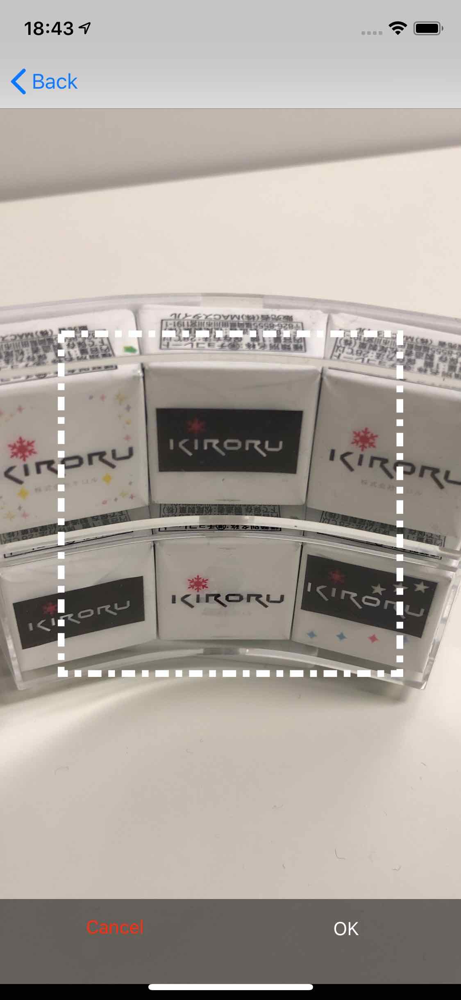

# KRImageTrimmer for iOS

[](https://cocoapods.org/pods/KRImageTrimmer)
[](https://cocoapods.org/pods/KRImageTrimmer)
[](https://cocoapods.org/pods/KRImageTrimmer)
[](https://cocoapods.org/pods/KRImageTrimmer)

KRImageTrimmer provides a screen to cut the image to be edited into a square.

## Screenshots



## Example

This is a sample to get an image from a camera or photo library and crop it with this library.
You can execute the sample in the following command.

Run `try pod` to open the sample project.

```shell-session
$ pod try KRImageTrimmer
```

## Installation

### CocoaPods

To install, add the following line to `Podfile`.

```ruby
target `MyProject` do
    use_frameworks!
    pod 'KRImageTrimmer'
end
```

### Carthage

To install, add the following line to `Cartfile`.

```ogdl
git "https://github.com/kiroru/KRImageTrimmer.git"
```

After building the framework by running `carthage update`, 
link` KRImageTrimmer.framework` to the project and import it with `import KRImageTrimmer`.

## Basic Usage

Show KRImageTrimmer

```swift
func show() {
    // various settings
    let options = KRImageTrimmerController.Options()
    options.cancelButtonTitle = "Back"

    // Create screen instances
    let vc = KRImageTrimmerController(options: options)

    // Set a delegate
    vc.delegate = self

    // Display KRImageTrimmer
    navigationController?.pushViewController(vc, animated: true)
}
```

Implement delegate processing

```swift
/// Pass the image to be edited
func imageForTrimming() -> UIImage {
    return UIImage(named: "sample")
}

/// Called when image editing is canceled
func imageTrimmerControllerDidCancel(_ imageTrimmer: KRImageTrimmerController) {
    navigationController?.popViewController(animated: true)
}

/// When image editing is completed, the image after editing will be returned
func imageTrimmerController(_ imageTrimmer: KRImageTrimmerController, didFinishTrimmingImage image: UIImage?) {
    navigationController?.popViewController(animated: true)
    imageView.image = image
}
```

## License

KRImageTrimmer is available under the MIT license. See the LICENSE file for more info.
